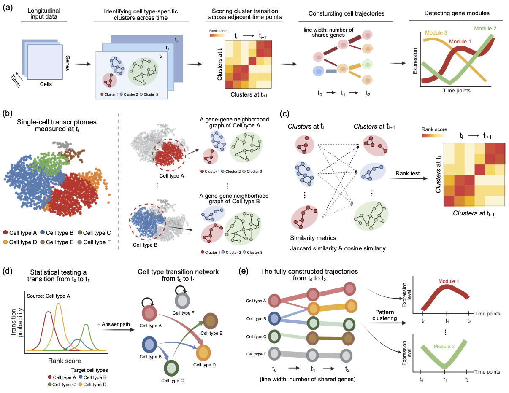

# Real-time trajectory inference from temporal single-cell expression via gene-module continuity and constrained transitions

GTra is a time-resolved trajectory inference framework for time-series single-cell RNA-seq data.  
It reconstructs **cell-state trajectories and dynamic gene programs** by modeling the continuity of co-expressed gene modules across physical time, without relying on pseudotime or predefined lineage structures.

---

## Overview

GTra directly leverages **longitudinal single-cell transcriptomic data** to infer trajectories of gene expression programs over physical time.

Instead of ordering individual cells along a pseudotime axis, GTra explicitly models how **co-expressed gene modules evolve and transition across adjacent time points**, enabling reconstruction of biologically meaningful trajectories without predefined lineage structures.

  

*Overview of the GTra framework.*

---

## Key concepts illustrated above

- **Longitudinal input data**  
  Time-series scRNA-seq profiles collected at discrete physical time points.

- **Gene-cluster identification within each time point**  
  Cell type–specific gene clusters are identified using gene–gene neighborhood graphs.

- **Inter-temporal transition scoring**  
  Gene clusters from adjacent time points are compared using  
  *Jaccard similarity* (gene overlap) and *cosine similarity* (expression directionality), yielding ranked transition scores.

- **Statistical testing and constrained transitions (Optional Answer path)**  
  Transition edges are statistically validated and filtered using biologically motivated (optional) path constraints to remove implausible connections.

- **Trajectory reconstruction and gene module detection**  
  Directed transition networks are assembled into full trajectories, and genes along each trajectory are summarized into representative temporal expression modules.

---

## Quick start

This repository contains the code used to generate the results reported in the accompanying manuscript.

GTra infers trajectories from time-series single-cell RNA-seq data by modeling transitions of gene expression modules across physical time.

Rather than ordering individual cells along a pseudotime axis, GTra reconstructs **directed trajectories of gene modules** by explicitly incorporating experimentally defined time points.

---

### Input data

GTra expects time-resolved single-cell transcriptomic data provided as an `AnnData` object with the following required annotations:

- **Expression matrix**  
  `adata.X` — gene expression matrix (cells × genes)

- **Physical time**  
  `adata.obs["time"]` — discrete time points (e.g. 0, 3, 24, 72)

- **Cell type labels**  
  `adata.obs["cell_type"]` — cell types or cell populations

- **Gene identifiers**  
  `adata.var_names` — gene symbols

---

### Output

GTra produces the following outputs:

- **Trajectory graph**  
  A directed network representing cell-state transitions across adjacent time points

- **Gene modules**  
  Trajectory-specific gene expression programs capturing coherent temporal dynamics

- **Transition statistics**  
  Statistically validated inter-temporal cluster transition scores

---

### Tutorials

Step-by-step tutorials and reproducible examples are provided in the `tutorials/` directory:

- Data preprocessing and input formatting  
- Trajectory reconstruction and visualization  
- Interpretation of gene modules and transition dynamics

---

## Applications

- Stimulus-response time-course scRNA-seq
- Developmental trajectory reconstruction
- Longitudinal disease progression analysis
- Patient-level trajectory integration

---

## License
This project is released under the MIT License.

---
